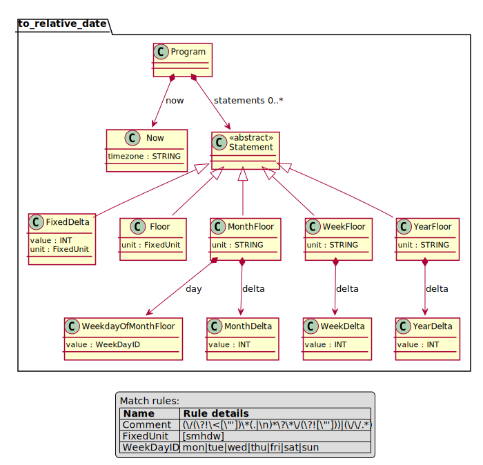

.. image:: https://github.com/iilei/dateexpressions/actions/workflows/python-package.yml/badge.svg
    :alt: Python package
    :target: https://github.com/iilei/dateexpressions/actions/workflows/python-package.yml

.. image:: https://img.shields.io/badge/-PyScaffold-005CA0?logo=pyscaffold
    :alt: Project generated with PyScaffold
    :target: https://pyscaffold.org/

.. image:: https://img.shields.io/badge/pre--commit-enabled-brightgreen?logo=pre-commit
   :target: https://github.com/pre-commit/pre-commit
   :alt: pre-commit

===============
dateexpressions
===============

    Parses relative date expressions so that you can say things like: ``now/d`` for the beginning of the day.

Inspired by Grafana Date Picker.

Allows for expressing relative date-times in a human friendly way.

.. code-block:: python

   from dateexpressions import parse

   # give me the last saturday of last month --
   # returning predictable results regardless of
   # when it get executed
   parse("""
            now /M :sat -1w
            /*
                ^ last saturday of previous month
            */
    """)

CLI Usage
============

The above via cli:

``date-expression isoformat 'now /M :sat -1w'``

The Optional ``preflight`` module can be installed on-demand, like ``pip install dateexpressions[preflight]``.

This allows to verify a date-expression: ``date-expression preflight --cron '0 3 1,2,17,30,31 1-12 *' 'now-78h/h'``

Check out the `Specs </tests>`_ for more usage scenarios.

Local Development
----------------------

Run all Tests, all Python Versions:

.. code-block:: sh

   tox
